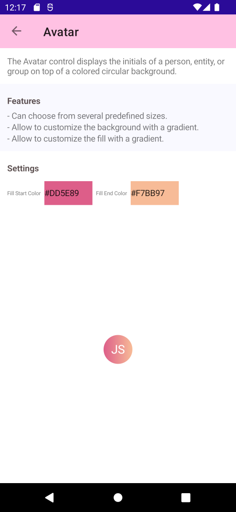
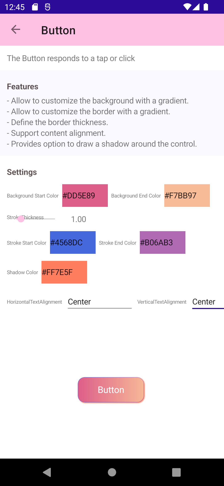
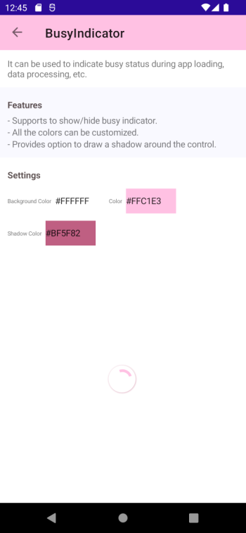
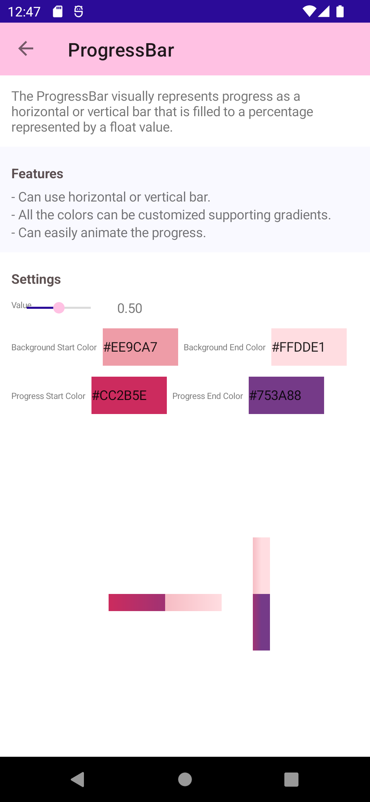
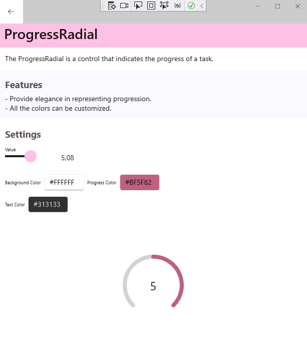
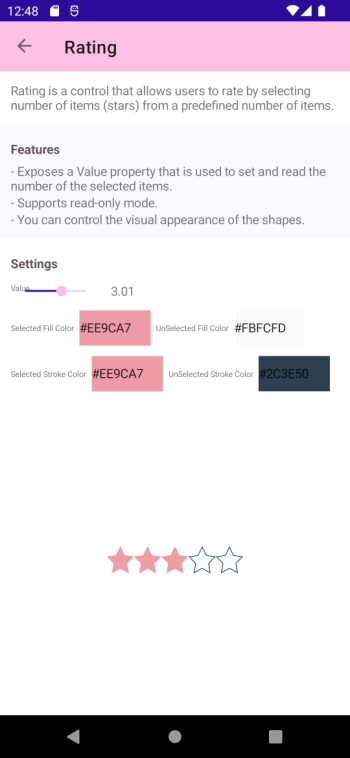
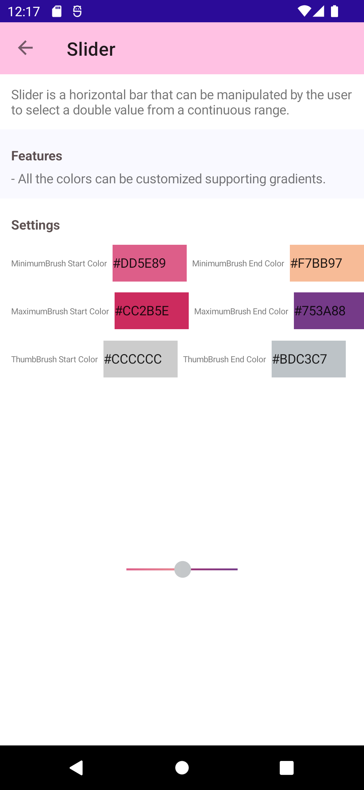
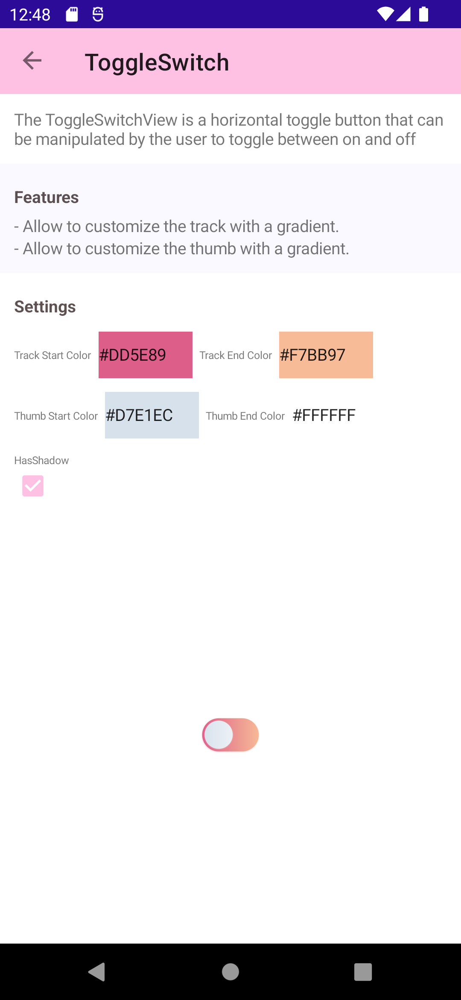

# AlohaKit

A set of .NET MAUI drawn controls.

#### Controls

The **controls** available are:

### Avatar

The Avatar control displays the initials of a person, entity, or group on top of a colored circular background.

Features:
- Can choose from several predefined sizes.
- Allow to customize the background with a gradient.
- Allow to customize the fill with a gradient.

### Button

The Button responds to a tap or click.

Features:
- Allow to customize the background with a gradient.
- Allow to customize the border with a gradient.
- Define the border thickness.
- Support content alignment.
- Provides option to draw a shadow around the control.

### BusyIndicator

It can be used to indicate busy status during app loading, data processing, etc.

Features:
- Supports to show/hide busy indicator.
- All the colors can be customized.
- Provides option to draw a shadow around the control.

### ProgressBar

The ProgressBar visually represents progress as a horizontal or vertical bar that is filled to a percentage represented by a float value.

Features:
- Can use horizontal or vertical bar.
- All the colors can be customized supporting gradients.
- Can easily animate the progress.

### ProgressRadial

The ProgressRadial is a control that indicates the progress of a task.

Features:
- Provide elegance in representing progression.
- All the colors can be customized.

### Rating

Rating is a control that allows users to rate by selecting number of items (stars) from a predefined number of items.

Features:
- Exposes a Value property that is used to set and read the number of the selected items.
- Supports read-only mode.
- You can control the visual appearance of the shapes.

### Slider

Slider is a horizontal bar that can be manipulated by the user to select a double value from a continuous range.

Features:
- All the colors can be customized supporting gradients.

### ToggleSwitch

The ToggleSwitch is a horizontal toggle button that can be manipulated by the user to toggle between on and off states.

Features:
- Allow to customize the track with a gradient.
- Allow to customize the thumb with a gradient.

## Contribute

Do you want to contribute?.

**Found a Bug?**

If you find a bug, you can help me by submitting an [issue](https://github.com/jsuarezruiz/AlohaKit/issues). Even better, you can submit a [Pull Request](https://github.com/jsuarezruiz/AlohaKit/pulls) with a fix.

**Submitting a pull request**

For every contribution, you must:
- Test your code.
- target main branch (or an appropriate release branch if appropriate for a bug fix).

## Feedback or Requests

Use GitHub [Issues](https://github.com/jsuarezruiz/AlohaKit/issues) for bug reports and feature requests.

## Principles

* Principle #1: Kept AlohaKit simple.
* Principle #2: Any control added must be a drawn control and allow to extend and customize everything.

## Copyright and license

Code released under the [MIT license](https://opensource.org/licenses/MIT).